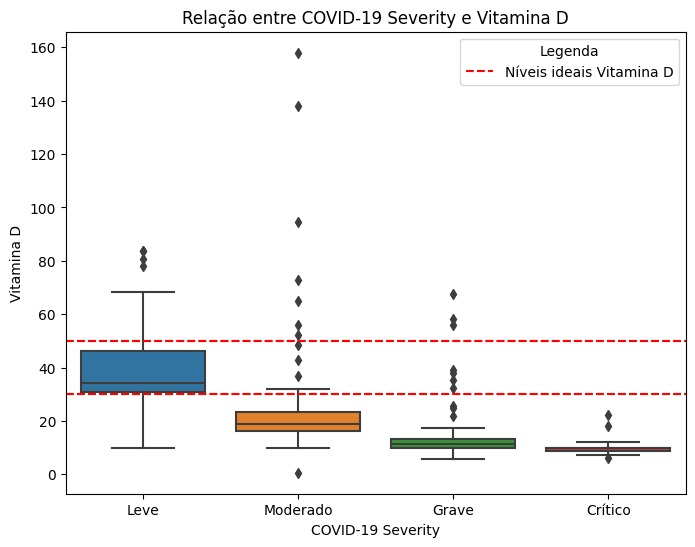
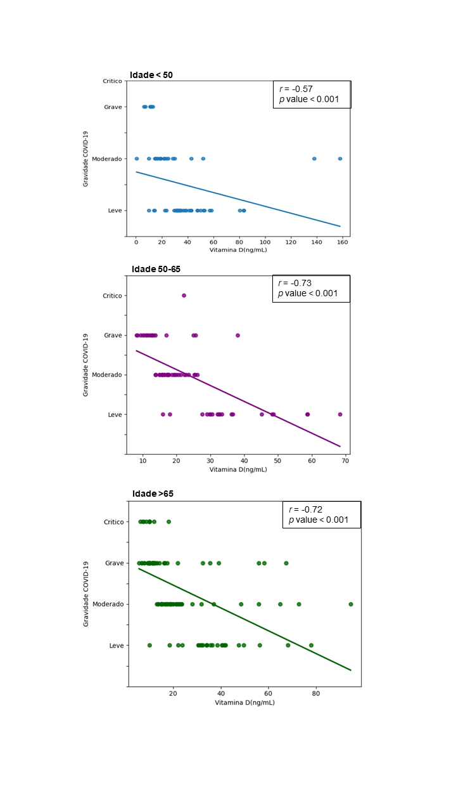
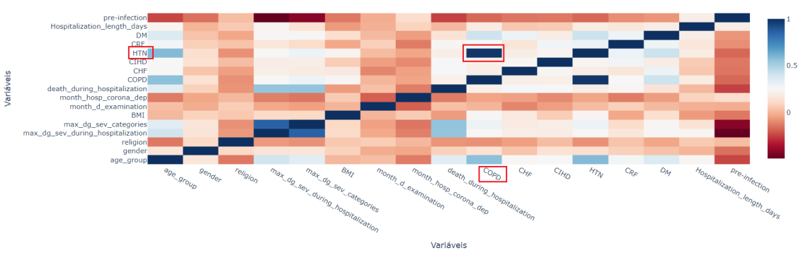

# Adicionar após a tabela de medidas estatística (tudo que está após isso na antiga entrega, pode ser excluído)

Afim de replicar os resultados obtidos por [Dror et.al(2022)](https://doi.org/10.1371/journal.pone.0263069.s001), diversas análises foram feitas. Inicialmente, a comparação dos valores de 25(OH)D pré-infecção e das categorias de gravidade da doença COVID-19 foi realizada, a Figura 3 demonstra uma diminuição progressiva nos níveis de 25(OH)D à medida que a gravidade da doença aumenta. 

### Figura 3- Box plot dos Níveis Séricos Pré-infecção de Vitamina D.

Fonte: Autores(2023)

Em seguida para análises de correlação, foram calculados os p-valores utilizando do teste de Wilcoxon (duas amostras independentes) afim de comparar os valores de 25(OH)D pré-infecção entre as categorias de gravidade da doença COVID-19. A Tabela 8 demonstra os valores obtidos na comparação entre as amostras de Leve e moderado, moderado e grave, e grave e crítico. Uma diferença significativa no nível de 25(OH)D foi encontrada entre as categorias de doença leve em comparação com moderada (p < 0.001) e moderada em comparação com grave (p < 0.002). 

### Tabela 8- P-valor Wilcoxon rank-sum test
|Amostra | p-valor|
 |--|--|
 | Leve-Moderado | p-value<0.0001 |
 | Moderado-Grave | p-value<0.0001 |
 | Grave-Crítico |p-value=0.04|
 
 Fonte: Autores(2023)
 
Por fim, as correlações entre o nível de 25(OH)D e a gravidade da doença COVID-19 (variável contínua e variável medida na escala ordinal) foram examinadas com o teste de coeficiente de correlação de Spearman. Embora a idade e o status de vitamina D pré-infecção sejam preditores independentes de aumento da gravidade da doença, uma correlação significativa foi encontrada entre a deficiência de vitamina D e a faixa etária(<50, 50–64, ≥65), como pode ser visto na Figura 4.

### Figura 5- Correlação entre o status de deficiência de vitamina D pré-infecção e a gravidade da doença COVID-19 - Divididos por Faixa Etária

Fonte: Autores(2023)

A correlação entre variáveis pode ser vista na Figura 4, em que, quanto mais escuro mais diretamente correlacionadas. A linha diagonal tem correlação 1 pois se refere à correlação de uma variável com ela mesma, mas é possível notar que a hipertensão HTN e COPD apresentam uma alta correlação. Isso sugere que há uma associação significativa entre essas duas condições crônicas. Fatores como tabagismo, obesidade e problemas de saúde em geral podem contribuir para o desenvolvimento e a progressão de ambas as doenças.

### Figura 4- Correlação entre Variáveis

Fonte: Autores(2023)

## Análise dos Resultados Eduarda

Analisando as informações obtidas na seção anterior é possível verificar que, de acordo com a Figura 4 a correlação mais forte entre os níveis mais baixos de 25(OH)D e a gravidade da doença de COVID-19 foi observada em pacientes com idade acima dos 50 anos (r = – 0,73; p <0,001 para idades de 50 a 64 anos; r = – 0,72; p < 0,001 para idades ≥65). Em pacientes com menos de 50 anos de idade, a gravidade da COVID-19 ainda estava correlacionada com a deficiência de vitamina D, mas em menor grau (r = – 0,66; p < 0,001). 
